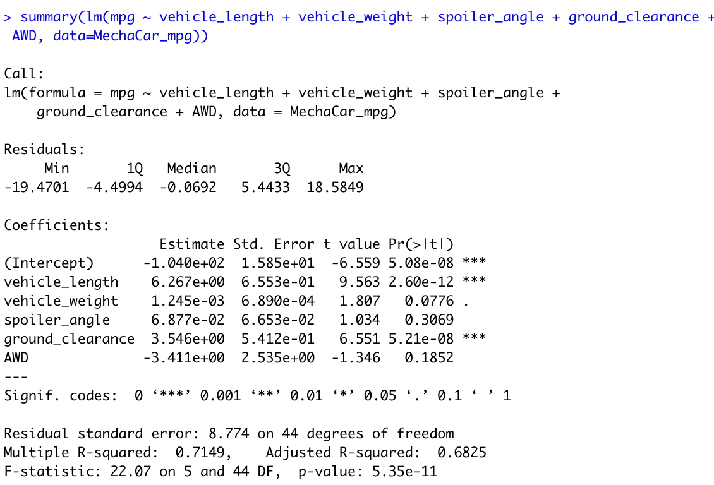
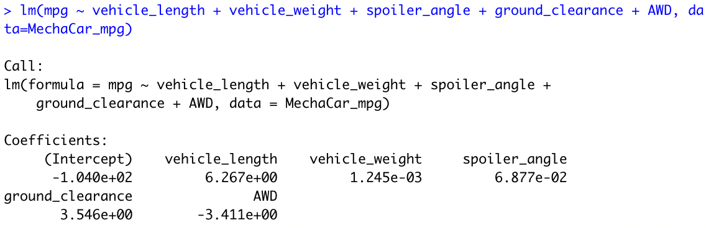

# MechaCar_Statistical_Analysis
## Linear Regression to Predict MPG
### Deliverable 1

1. Which variables/coefficients provided a non-random amount of variance to the mpg values in the dataset?

In the summary output, each Pr(>|t|) value represents the probability that each coefficient contributes a random amount of variance to the linear model. Based on the Pr(>|t|) value, **ground clearance** and **vehicle length** are statistically likely to provide non-random amounts of variance to the linear model. In other words the vehicle length and clearance have a litter impact on miles per gallon MechaCar prototype. On contrast, **vehicle weight, spoiler angle** and **All Wheel Drive (AWD)** are statistically unlikely to provide random amounts of variance to the linear model.

2. Is the slope of the linear model considered to be zero? Why or why not?

No, the slope of the multiple linear regression model is not equal to zero. Because the p-value is 5.35e-11, which is much smaller than the presumed significance level of 0.05. Therefore, we should **reject the null hypothesis** of the slope being zero.

3. Does this linear model predict mpg of MechaCar prototypes effectively? Why or why not?

The R-squared of the linear model is 0.7149, indicating that approximately 71% of the mpg prediction can be explained by this model. For that reason, linear model **does predict** mpg of MechaCar prototypes effectively.

### Deliverable 2

## Summary Statistics on Suspension Coils
Q: The design specifications for the MechaCar suspension coils dictate that the variance of the suspension coils must not exceed 100 pounds per square inch. Does the current manufacturing data meet this design specification for all manufacturing lots in total and each lot individually? Why or why not?
A: The design of MechaCar suspension soils must not exceed 100 pounds per square inch. From the above screenshoot we can see, Lot1(Var=0.98) and Lot2(Var=7.47) are within the requirement. However, the variance of Lot3(Var=170.29) is greatly exceeds the requirement. This is why consist a high overall variance of 62.293.

### Deliverable 3
## T-Tests on Suspension Coils
**T-test results across all manufacturing lots**

The aboved picture shows a p-value of 0.06028, which is lower than the common significant level 0.05. In other words, there is not enough evidence to support rejecting the null hypothesis. 

**T-test result of Lot1**

Lot1 has a exactly 1 p-value and the same mean of 1500. Therefore, there is obviously not evidence to reject the null hypothesis.

**T-test result of Lot2**

Lot2 with a 0.6072 p-value relatively larger than the common significant level 0.05. Also, it has a similar mean with 1500.Thus, we cannot reject the null hypothesis. 

**T-test result of Lot3**

Lot3 is different from the other two sample with a p-value 0.04168 which is lower than common significant level 0.05 and a mean of 1496.14. This implies that the null hypothesis should be rejected.

### Deliverable 4
## Study Design: MechaCar vs Competition
